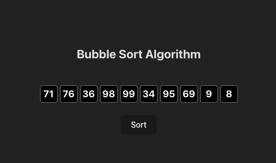

# Bubble Sort Visualization

Проект для визуализации алгоритма сортировки пузырьком с анимацией на Vue 3 + TypeScript.

## Особенности

- 🎭 Пошаговая анимация сравнения и перестановки элементов
- 🎨 Визуальные состояния элементов

## Технологии

- Vue 3 (Composition API)
- TypeScript
- Less (для стилей)
- Vite (сборка)